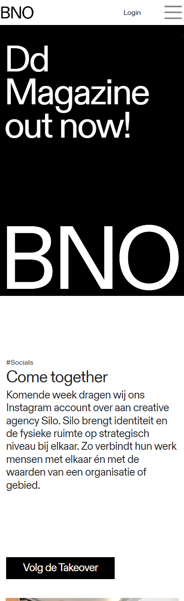
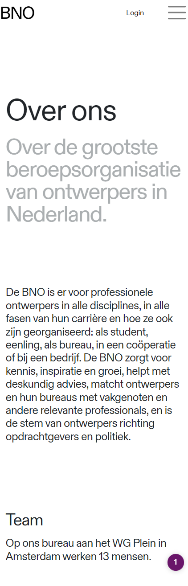

# Procesverslag FED2 2022/2023 Henriks Porciks INH02

Henriks Porciks FED2

### Auteur:
Henriks Porciks

#### Startniveau:
Rood, wellicht Blauw na enkele lessen

#### Focus:
Responsive 

## Website voor FED2

BNO Website

### BNO - Beroepsorganisatie Nederlandse Ontwerpers
 
Landingspagina + een Iteratie op Over Ons

##### Screenshot(s) van de BNO Landingspagina (small screen): 

#### Screenshot(s) van de  BNO Over Ons (small screen):

 
### Toegankelijkheidstest resultaten:

#### ADHD

Navigatie is slecht en moeizaam, zou beter sticky zijn
Text en typografie is voldoende groot
Er is weinig context aan het begin van de pagina

#### Tunnelvisie
Zoeken in menu levert soms te weinig contrast op

Text en typografie is groot, fijn
Menu items moeilijk te lezen
Van dichtbij is het goed te lezen
Muis vinden moeilijk met tunnelvisie
Externe dingen echt te klein niet leesbaar

#### Parkinson

Menu moeilijk is erg moeilijk, raakvlak is te klein
 
Knoppen en links zijn te klein en moeilijk te raken 
Actie binnen de site ligt diep begraven

#### Navigeren met TAB en Narrator

Skipt over headers
Geen focus state bij tabben 
Geen visuele feedback, men ziet niet waar men is, doordat de selctie is niet outlined
Geselecteerde foto niet zichtbaar
Geen foto ALT teksten
Outline soms onvolledig

#### IDEA: Skip to content for tabb

#### Opgevallen
 
Darkmode afwezig

## Breakdownschets

Week 1

### BNO Home Pagina 

https://www.figma.com/file/0rUA2cLfqf5cGqefEOSDLT/Front-End-Template?node-id=0%3A1

## Voortgang 1

Week 2

### Stand van zaken
Nog moeite met de hoeveelheid code, maar vooral focus op semantiek

### Agenda voor meeting

#### Henriks
- De vertaalslag van breakdownschets naar HTML

#### Giorgio
- Vertaalslag van breakdownschets naar HTML

#### Nathan
- HTML code
 
#### Jesse
- HTML code
- Breakdownschets

#### Emilio
-  Breakdownschets
 
 
### Verslag van meeting

- <article> naar <ul><li> veranderen
- ALT image text niet vergeten
- Verder uitwerken

## Voortgang 2

Week 3

### Stand van zaken
 
#### Ging goed
 
 Het maken van root colors en de juiste font grottes overal toepassen
 
#### Ging minder goed

 Veel moeite met flexbox en grid daadwerkelijk aan het werk te krijgen
 
### Screenshot(s)
 
 

#### Agenda voor meeting

#### Henriks
 GRID en FLEXBOX, m.b.t responsiveness van bepaalde onderdelen van de website, het wilt niet lukken

#### Giorgio
 Ik wil alleen mijn HTML en CSS bespreken, vooral over de breakpoints en hoe je het goed responsive krijgt.

#### Nathan Stuger
 Afwezig
 
#### Jesse
 
 CSS en JS interactie

### Verslag van meeting

- Begin met kleinste variant van het grid eerst
- Voeg <h2> toe aan <section> zonder titel en gebruik display:none; in CSS

## Toegankelijkheidstest

Week 4

### Bevindingen

#### Titel eerste bevinding
Hier korte omschrijving (met indien nodig een afbeelding)

Hier een omschrijving van hoe het opgelost kan worden (met indien nodig een afbeelding)

#### Titel tweede bevinding. 
Hier korte omschrijving (met indien nodig een afbeelding)

Hier een omschrijving van hoe het opgelost kan worden (met indien nodig een afbeelding)

#### Titel volgende bevinding. 
Hier korte omschrijving (met indien nodig een afbeelding)

Hier een omschrijving van hoe het opgelost kan worden (met indien nodig een afbeelding)

#### Titel nog een bevinding. 
Hier korte omschrijving (met indien nodig een afbeelding)

Hier een omschrijving van hoe het opgelost kan worden (met indien nodig een afbeelding)

## Voortgang 3

Week 4

### Stand van zaken

HTML en basis CSS ging goed, alles staat zo goed als, erg compleet

Responsive maken, menu verkeerd begonnen, eerst kleinste versie uitwerken en dan groter
Moeite met paddings
Volgorde met Flex gedaan, maar twijfels of ik toch niet GRID moet gebruiken

### Agenda voor meeting

#### Jesse [SERVICE]
- De CSS van de tweede pagina
- Wat JS 

#### Emilio [SERVICE]
- Footer: CSS - Label & Input
- Animeren Button

#### Giorgio [RESPONSIVE]
- Responsiveness

#### Henriks [RESPONSIVE]
- Media queries
-Onverwachte spacing/padding/margin
- Twee losse CSS bestanden
- Javascript gedrag, menu niet overlay, maar content push-down

### Verslag van meeting
hier na afloop snel de uitkomsten van de meeting vastleggen

- punt 1
- punt 2
- nog een punt
- ...

## Eindgesprek

Week 5

### Stand van zaken
 
#### Ging goed
 
#### Ging minder goed

### Screenshot(s)

## Bronnenlijst

continu bijhouden terwijl je werkt

Nb. Wees specifiek ('css-tricks' als bron is bijv. niet specifiek genoeg).

1. bron 1
2. bron 2
3. ...

